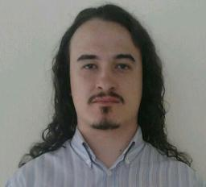

## Curriculum

<!-- 
 -->
<!--  -->
<!-- 
 -->

<!-- 
 -->
<!--  -->
<!-- 
 -->

<!--  -->

Name     | Bruno Félix Rezende Ribeiro
Country  | Brazil
Birth    | 1989
Homepage | [oitofelix.com](http://oitofelix.com/)
Email    | [oitofelix@gnu.org](mailto:oitofelix@gnu.org)
LinkedIn | [linkedin.com/in/oitofelix](http://www.linkedin.com/in/oitofelix)
YouTube  | [youtube.com/channel/UC1oBkjjTWGUqKdy3f966Nng](https://youtube.com/channel/UC1oBkjjTWGUqKdy3f966Nng)
Twitter  | [twitter.com/oitofelix](https://twitter.com/oitofelix)
Facebook | [facebook.com/8oitofelixF](https://www.facebook.com/8oitofelixF)
reddit   | [reddit.com/user/oitofelix/](https://www.reddit.com/user/oitofelix/)
Patreon  | [patreon.com/oitofelix](https://www.patreon.com/oitofelix)
GPG      | [7CB1 208C 7336 56B7 5962  2500 27B9 C6FD 28D6 18AF](/oitofelix.gpg)
SSH      | [c6:11:b0:09:0d:b7:0e:4b:49:d1:36:88:da:33:a3:6e](/oitofelix.ssh)

I'm a computer programmer with a Bachelor's degree in Mathematics.  In
the free software community I work on the development of several
projects of my own making, contribute to other projects, write
documentation, publish technical articles, do translation work, help
in infrastructure maintenance and provide support to users.  I
consider myself a good fit for any software development position
because I have the technical skills necessary to get the job done, and
foremost because I'm the kind of person that will put his full
potential into solving the company's problems and making their
projects succeed. By my experience in the free software community,
I've developed excellent communication and coordination skills,
necessary to work productively within development teams of diverse
cultural, philosophical and technical backgrounds.  Below you can find
a list of my published works and past experience that demonstrate my
areas of expertise.  A frequently updated version of my curriculum can
be found online at my
[personal website](http://oitofelix.com/curriculum.html).
**Looking forward to work with you!**

<!-- Contractors -->

### Contractors

Company                                        | Period
-----------------------------------------------|--------------------------
[Yandeh](https://www.yandeh.com.br/)           | Feb 2020 -- Current date
[Softbox](http://www.softbox.com.br/)          | Dec 2017 -- Feb 2020
[Morpheus](http://www.morpheustecnologia.com/) | Nov 2017 -- Dec 2017

<!-- Software -->

### Software

Project | Description
--------|--------
[MININIM](mininim/) | free software implementation of Jordan Mechner’s original Prince of Persia game
[GNU ccd2cue](http://www.gnu.org/software/ccd2cue/) | CCD sheet to CUE sheet converter
[ELPA](elpa/) | oitofelix’s Emacs Lisp Package Archive
[Scripts](scripts.html) | Simple scripts to make life easier
[QDot 8086](qdot-8086/) | mid-level programming language for the IBM-PC
[Terminal Matrix 8086](terminal-matrix-8086/) | terminal communication program
[DeciMatrix 8086](decimatrix-8086/) | matrix-like screen-saver
[8F UserRPL Kernel](8f-userrpl-kernel/) | HP 50g extension library for UserRPL programming
[HP 50g JV](http://www.hpcalc.org/details.php?id=7171) | tic-tac-toe game written in System RPL for the HP 50g calculator
[PlayStation 2 Linux](ps2-linux/) | PS2 Linux memory card and multi-tap device drivers and png2rgb tool
[grunt-hardlink](http://www.npmjs.com/package/grunt-hardlink) | Grunt plugin for creating hard links
[Allegro 5](https://github.com/liballeg/allegro5/search?q=author%3Aoitofelix&type=Commits&utf8=%E2%9C%93) | low-level game library (patches)
[Ports](ports/) | software ports to eccentric platforms

<!-- [MerpC](merpc/) | Cordova-based thin client for systems serving databases through web services -->

<!-- Non-software -->

### Non-software

[Savannah CVS to Git migration](article-savannah-cvs-to-git-migration/) | article
[GPG and SSH key handling](article-gpg-and-ssh-key-handling/) | article
[TLS: Libre Software](presentation-tls-libre-software/) | presentation
[Stallman's speech on free software](translation-stallman-speech-on-free-software) | translation
[The GNU project](http://www.gnu.org/gnu/thegnuproject.pt-br.html) | translation
[Free Software Is Even More Important Now](http://www.gnu.org/philosophy/free-software-even-more-important.pt-br.html) | translation
[TCC Buchberger UserRPL](academic/TCC%20-%20Buchberger%20UserRPL.pdf) | academic
[Proof of Tychonoff theorem](academic/Teorema%20de%20Tychonoff.pdf) | academic
[Proof of Jordan-von Neumann theorem](academic/Jordan-von%20Neumann%20Theorem.pdf) | academic
[XXXIII CNMAC](https://web.archive.org/web/20171010104336/http://www.sbmac.org.br/eventos/cnmac/xxxiii_cnmac/pdf/481.pdf) | academic
[GNU philosophy](gnu-philosophy/) | documentation
[oitofelix's homepage](/) | website

<!-- Additional Experience -->

### Additional Experience

- In the GNU project I've had several responsibilities:
[ccd2cue maintainer](http://www.gnu.org/software/ccd2cue/),
[Savannah hacker](https://savannah.gnu.org/project/memberlist.php?group=administration),
[webmaster](http://www.gnu.org/people/webmeisters.html#oitofelix),
[audio and video maintainer](http://audio-video.gnu.org/),
[ethical repository criteria maintainer](http://www.gnu.org/software/repo-criteria.html#oitofelix),
and
[web translation team coordinator (Brazilian Portuguese)](http://www.gnu.org/server/standards/translations/pt-br/updates.html#table-contrib-ranking)
- Building, improving and maintaining for two years his own version of
  the GNU+Linux-libre operating system, based on
  [(GNU/)Linux from scratch](http://www.linuxfromscratch.org/)
- Setting up and using several flavors of GNU/Linux distributions
- Providing support for users and developers of the GNU+Linux
  operating system in several mailing lists and IRC channels for many
  years
- Assembling personal computers from component parts and
  fault-diagnosing hardware as a computer technician
- [UFU FAMAT PET member](https://web.archive.org/web/20171210150215/http://www.portal.famat.ufu.br/node/274)

